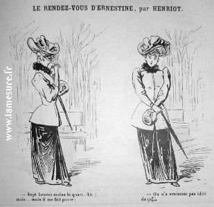
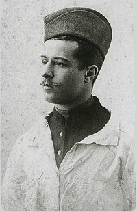

# La vita

## L'infanzia

Conosciuta da tutti come **Chanel**, all'anagrafe è infatti registrata erroneamente come **Chasnel**, un errore di scrittura mai corretto da Coco in quanto il dover rivelare pubblicamente lo stato di povertà della sua famiglia, compresa la nascita della stessa in un ospizio per gente povera, avrebbe puntato mettere a rischio la sua carriera.

Nata nel **1883** a **Saumur**, un piccolo comune francese noto per i suoi spettacoli di equitazione con cavallieri vestiti quasi interamente di nero, colore che successivamente ispirò lo stile della stilista stessa.

Dopo la morte della madre, ammalata di **tubercolosi** , il padre di Coco affidò i figli alla nonna paterna.

## La vita in convento

La nonna decise sin da subito di affidare le ragazze alle suore del **convento "sacro cuore di Maria"** di **Aubazine**, un paese più a sud della francia e indirizzare i maschi verso proprietari di terreni che potessero offrirgli un lavoro come contadini.

Forse è proprio in convento che Coco ha modo di apprendere la sua passione per la moda e per il cucito, tanto da ritagliarsi un po' di tempo, tra una mansione e l'altra, per creare dei vestiti per le sue bamboline di pezza.

Le uniformi delle suore furono d'ispirazione per la stilista con il loro stile monocromatico.

## Gabrielle diventa Coco

Una volta uscita dal convento Chanel trova lavoro come **sarta**, aiutata soprattutto dalle nozioni di cucito apprese negli anni precedenti.

Durante il tempo libero invece la ragazza si esibiva in un locale di Parigi chiamato **"La Rotonde"**: un punto di ritrovo per gli artisti del posto.

Qui ella si esibiva come "poseuse", ovvero la figura che aveva il compito di intrattenere il pubblico tra le esibizioni dei performatori più importanti.

Il suo cavallo di battaglia era la canzone _"Chi ha visto Coco?"_ (in francese _"Qui qu'a vu Coco?"_), tanto che il pubblico iniziò a chiamarla con il nome stesso della protagonista della sua canzone: **Coco**.

Chanel a dirla tutta non apprezzava l'origine del suo soprannome, tanto che in futuro alla domanda "da dove proviene?" ella rispondeva "è come mio padre mi chiamava da piccola".

## Il primo amore

All'età di **23 anni** la futura stilista conobbe **Etienne Balsan**, un appassionato del mondo equestre che s'innamorò di Coco.
Esso fece conoscere a Gabrielle la lussuria tra diamanti, perle e vestiti sfarzosi.

L'amico di Balsan **Arthur**, colpito dall'abbigliamento della ragazza, decise di finanziarla e di acquistarle un appartamento a Parigi.

Aprì un **negozio di cappelli** dove ammagliava i clienti con copricapi dal design relativamente semplice, dato che, non avendo nè formazione tecnica nè gli strumenti necessari, doveva acquistare le forme nei grandi magazzini per poi modificarle prima di rivenderle.

## Chanel nel mondo della moda

Chanel aprì un salone di moda che chiamò **"Chanel Modes"**.

Oltre al primo negozio ne venne inaugurato un secondo a **Douville**: **"GABRIELLE CHANEL"** e succesivamente anche un terzo a **Biarritz**.

Gli articoli vanduti nelle sue boutique andavano dalle gonne alle giacche e cappelli; tutti riconoscibili per il loro stile innvativo.

Le gonne erano più corte del "normale" e non avevano la vita, ispirata forse da **Paul Poiret** anche Chanel voleva liberare la figura femminile dagli scomodi standard di moda di quel tempo, riuscendo a ricevere inoltre grande successo grazie alla clientela che, durante la guerra, si ritirò in quei comuni.

Il propblema principale delle gonne del tempo era l'eccessiva aderenza e la difficoltà nell'utilizzarle soprattutto durante le camminate, tanto che le signore di quell'epoca dovevano avanzare a piccoli passi.

Chanel decise di ridisegnare il vestito eliminando i corsetti che contenevano all'interno delle stecche rigide che aiutavano la vita delle signore a risultare più stretta e snella in cambio di una scomodità eccessiva che le costringeva a procedere sempre con movimenti delicati. 

Gabrielle prese in colore nero e gli diede un nuovo significato: da lutto e tristezza ad eleganza ed eccellenza.

Altri colori a cui la stilista diede nuova vita furono:

- Il bianco: simbolo di purezza e ottimo contrasto per il sopracitato nero.
- Il beige: che si abbinava perfettamente coi due colori precedenti per creare una tripletta elegante e senza tempo.
- Il blu navy: che, insieme al rosa cipria creava un piacevole contrasto. 
- Il rosa cipria: che donava agli indumenti femmilità dallo stile romantico.

Chanel adorava inoltre il rosso perché lo riteneva il colore della vita e del sangue, ma lo si nota solo in poche delle sue creazioni, dato che lei stessa lo riteneva un colore molto pericoloso da utilizzare in quanto capace di portare l'abito ad un livello superiore quanto a distruggere completamente la sua armonia.

Nemmeno il mondo dei copricapi trovò scampo dalla rivoluzione stilistica che Chanel stava mettendo in atto: cappelli d'apprima larghi e carichi di decorazioni vengono rivisti e privati di quegli inutili fronzoli e piume.

Una moda di quel tempo erano i cappelli larghi e carichi di decorazioni, una peculiarità che, secondo Chanel, era inappropriata e superflua, infatti i suoi cappelli raffiguravano la semplicità su misura con un design elegante privo di quegli inutili fronzoli e piume.

Probabilemnte questa scelta fu aiutata dal fatto che, come detto precedentemente, Coco al tempo non aveva grandi conoscienze tecniche e forse è proprio per questo che i suoi copricapi avevano uno stile pulito e minimale.

## Povertà di lusso

Durante la sua ascesa Cocco creeò una collezione chiamata “povertà di lusso” che traeva ispirazione dagli abiti quotidiani dei cittadini parigini.

Il punto di forza di tale collezione fù il compromesso che la stilista seppe dare ad uno stile borghese
e modesto con il lusso di poter possedere dei capi realizzati con materiale pregiato come bottoni dorati e Jersey. Non mancavano però di certo le sue idee rivoluzionarie: le donne dovevano potersi concedere di indossare pantaloni, giacche e cardigan comodi proprio come fino ad allora solo i signori della sua epoca potevano vestire!

## Stile alla marinara

Una branca della sua collezione era dedicata allo "stile alla marinara", uno stile di vestiario tributo alle classiche uniformi da marinaio. 

La marinière, ovvero una maglietta decorata con righe orizzontali, fù uno degli indumenti più famosi di questo stile. 

Le righe provenivano in realtà dalla necessità dei marinai di rendersi il più visibili possibile in caso di caduta in mare, visibilità che Coco riuscì a cogliere e ad applicare alla vita quotidiana; non vi era infatti passante che non rimanesse ipnotizzato da quelle righe scure che facevano contrasto con la base bianca.